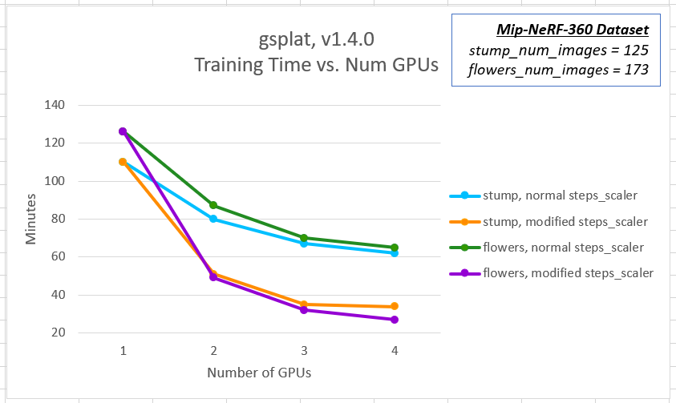
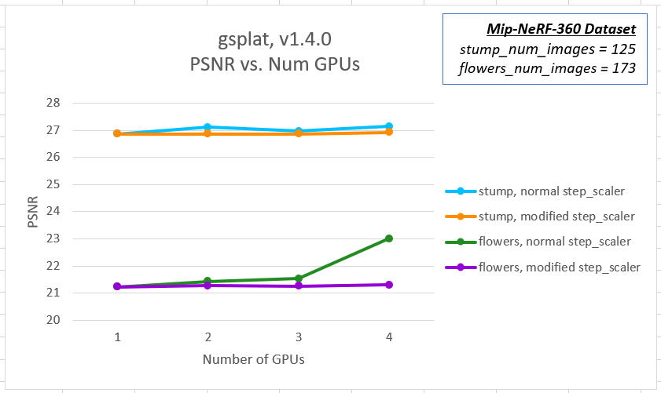
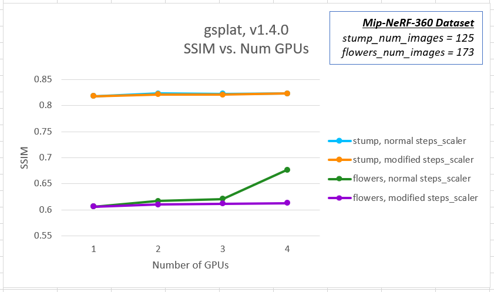
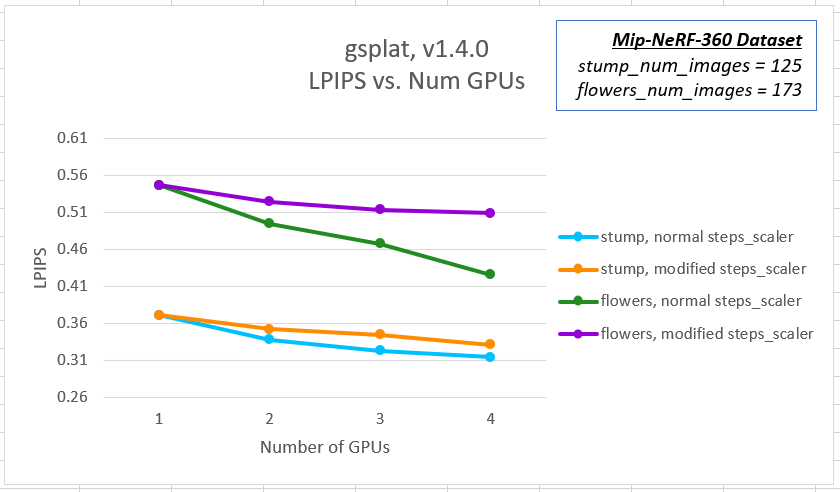
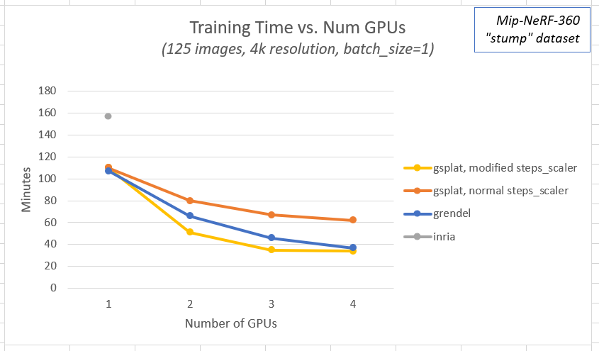
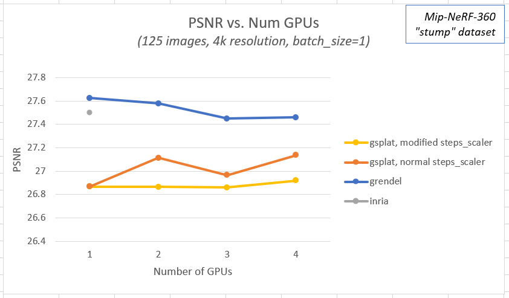
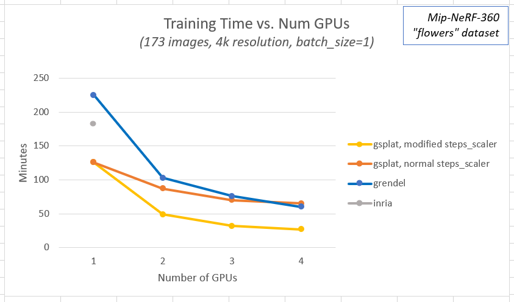
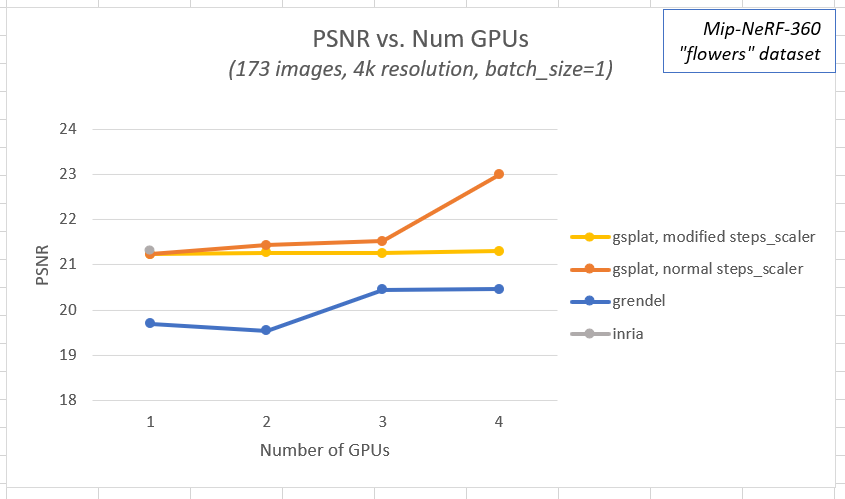
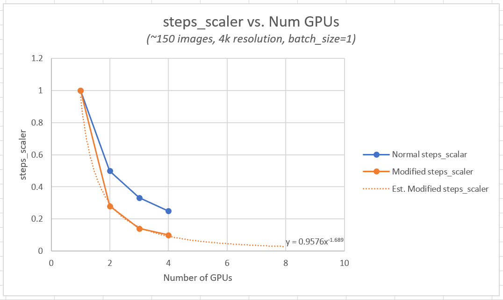

# Gaussian Splatting Multi-GPU Guide
*A benchmarking guide for [gsplat](https://github.com/nerfstudio-project/gsplat) multi-GPU training*

## Motivation
- Gaussian splatting is a powerful tool for creating realistic 3D assets, but training times can be prohibitive
  - A typical dataset (300 images at 4k) requires ~1 hour of training on an [AWS g5 instance](https://aws.amazon.com/ec2/instance-types/g5/) (NVIDIA A10G) at maximum steps (30k)
  > *Note: The time above does not include any preprocessing or structure from motion (SfM) time which could range from 2-15min based on input provided (video, images, poses, features, etc.)*

- This repository aims to provide comprehensive insights into:
  - Training duration
  - Output quality
  - Dataset characteristics
  - Scaling efficiency
  - Performance metrics using a cloud desktop (see Summary below for exact hardware used for experiments)

## Technical Approach
- **Data Parallelism Benefits**
  - Gaussian splatting models are compact enough to fit on a single GPU (e.g., NVIDIA A10G)
    - The caveat to this is that GS training is very sensitive to image resolution and number of images
    - This means while increasing resolution, or increasing the number of images, generally speaking the more GPU VRAM is required.
    - Our experiments confirm that 300 4k images can be trained on 24GB VRAM. Increasing image resolution and/or adding more images will require more user testing to ensure the entire trained model can fit on the GPU.
  - Dataset can be efficiently distributed across multiple GPUs
  - Model's small size enables full GPU utilization

- **Multi-node Limitations with GS Models**
  - Limited/unknown benefits from multi-node/multi-machine setups at this time. Further tests need to be conducted. 
  - It's possible that multi-node training will allow increased resolution, but that is out of scope for the current version of this project.
  - Interconnect latency impacts performance. Further tests need to be conducted.
  - Cost-prohibitive compared to single-node multi-GPU solutions. Further tests need to be conducted.

## Repository Features
- Comprehensive multi-GPU distributed training setup documentation
    - Current data in this repo was produced using a single node/machine, multiple GPUs on a single machine.
- Benchmark results for various models, focusing on [gsplat](https://github.com/nerfstudio-project/gsplat) (Apache-2.0 licensed)
- Analysis of quality/speed trade-offs for sparse reconstruction scenarios:
  - Small datasets (<200 images)
  - 4K resolution images
  - Based on Mip-NeRF-360 datasets

## I. Summary
### Hardware used
- [g5.12xlarge](https://aws.amazon.com/ec2/instance-types/g5/)
    - [4 x A10G, 24GB each](https://www.nvidia.com/en-us/data-center/products/a10-gpu/)
- If you have an AWS account, use the AWS CloudFormation template [here](https://github.com/aws-samples/aws-deep-learning-ami-ubuntu-dcv-desktop) to spin up a full featured Ubuntu GPU desktop with NiceDCV remote display protocol for streaming the desktop

### Datasets used
- [Mip-NeRF 360 Dataset Download](https://jonbarron.info/mipnerf360/)
    > *Note: The number of images in the dataset and image resolutions below are the baseline meaning the entire dataset was used at full resolution.*
    - Stump
        - Total number of images in dataset
            - 125
        - Image resolution
            - 4978x3300

    - Flowers
        - Total number of images in dataset
            - 173
        - Image resolution
            - 5025x3312

### Models Used in Experiment
- [gsplat mcmc (v1.4.0)](https://github.com/nerfstudio-project/gsplat) - [Apache-2.0 license](https://github.com/nerfstudio-project/gsplat?tab=Apache-2.0-1-ov-file#readme)

- [Inria (commit v54c035f)](https://github.com/graphdeco-inria/gaussian-splatting) - [Inria license](https://github.com/graphdeco-inria/gaussian-splatting?tab=License-1-ov-file#readme)

- [Grendel-GS (commit e5fa1e9)](https://github.com/nyu-systems/Grendel-GS) - [Apache-2.0 license](https://github.com/nyu-systems/Grendel-GS/tree/main?tab=Apache-2.0-1-ov-file#readme)

### Metrics Compared
- Training Time
- Quality
    - [Peak signal-to-noise ratio (PSNR)](https://en.wikipedia.org/wiki/Peak_signal-to-noise_ratio)
        - The higher the metric, the better quality
    - [Structural Similarity Index Measure (SSIM)](https://en.wikipedia.org/wiki/Structural_similarity_index_measure)
        - The higher the metric, the better quality
    - [Perceptual Similarity (LPIPS)](https://github.com/richzhang/PerceptualSimilarity)
        - The lower the metric, the better quality

### Graph Variations
> *Note: the results will show steps_scaler baseline and tuned step_scaler based on experiment results*
- Training Time vs. Number of GPUs
- PSNR vs. Number of GPUs
- SSIM vs. Number of GPUs (gsplat only)
- LPIPS vs. Number of GPUs (gsplat only)

## II. Results
**TL;DR**

- Decreases in Training Time with [gsplat](https://github.com/nerfstudio-project/gsplat)
    > *NOTE: data reflects when tuning step scaler to output baseline quality, see data, graphs, and trend line calculated*
    - (QTY 2) GPUs => 55% decrease in training time (2.4x speed-up)
    - (QTY 3) GPUs => 70% decrease in training time (3.5x speed-up)
    - (QTY 4) GPUs => 75% decrease in training time (3.9x speed-up)
- [gsplat](https://github.com/nerfstudio-project/gsplat) has shown to have equal quality than others ([Inria](https://github.com/graphdeco-inria/gaussian-splatting) and [Grendel-GS](https://github.com/nyu-systems/Grendel-GS)) at baseline number of steps, but is faster by small amount when using the modified step_scaler equation below.
- **Steps scaler** parameter in [gsplat](https://github.com/nerfstudio-project/gsplat) does not accurately scale to maintain constant quality when increasing number of GPUs (requires tuning or just use the estimated equation below).
    - Current official gsplat guidance for step_scaler: `normal steps_scaler = 1/(num_gpus*batch_size)`
    - If using above equation for step_scaler, a steady increase in quality will be observed when increasing the number of GPUs.
        - Therefore, the provided equation below should be used instead for the step scaler in order to maintain constant quality.
        - Our experiments show to use: `modified steps_scaler = 0.9576*(num_gpus*batch_size)^(-1.689)` based on a trend line of the data we tested (see in Graphs section). This number was empirically found using various step_scaler values that yielded approximately the same quality as with training with one GPU. The actual value will be dataset sensitive based on our experiments.
- Model does not benefit greatly increasing batch sizes with 4k resolution (sometimes OOM); stick to one batch size unless training 2k resolution or less.
- Model would not benefit from multi-node/multi-machine training due to small size of model and accumulated interconnect lag

### Data
 *** 
 *** 
#### Stump dataset, gsplat (v1.4.0 mcmc), G5.12xlarge (4x, A10G, 24GB)
| Dataset | Number of Images | Image Resolution | Data Scale Factor | Num GPUs | Batch Size | Steps Scaler | Avg. GPU Utilization | Avg. VRAM Memory Usage per active GPU | Elapsed Time (min) | PSNR | SSIM | LPIPS |
|---------|-----------------|------------------|-------------------|-----------|------------|--------------|---------------------|--------------------------------------|-------------------|-------|-------|--------|
| stump | 125 | 4978x3300 | 1 | 1 | 1 | 1.000 | 100% | 65% | 110 | 26.868 | 0.8178 | 0.371 |
| stump | 125 | 4978x3300 | 1 | 2 | 1 | 0.500 | 100% | 80% | 80 | 27.115 | 0.823 | 0.338 |
| stump | 125 | 4978x3300 | 1 | 2 | 1 | 0.300 | 100% | 80% | 51 | 26.866 | 0.8216 | 0.352 |
| stump | 125 | 4978x3300 | 1 | 3 | 1 | 0.333 | 100% | 80% | 67 | 26.967 | 0.8226 | 0.323 |
| stump | 125 | 4978x3300 | 1 | 3 | 1 | 0.160 | 100% | 80% | 35 | 26.861 | 0.821 | 0.345 |
| stump | 125 | 4978x3300 | 1 | 4 | 1 | 0.250 | 100% | 80% | 62 | 27.136 | 0.823 | 0.314 |
| stump | 125 | 4978x3300 | 1 | 4 | 1 | 0.125 | 100% | 75% | 34 | 26.919 | 0.8228 | 0.331 |

 *** 
 *** 

#### Flowers dataset, gsplat (v1.4.0 mcmc), G5.12xlarge (4x, A10G, 24GB)
| Dataset | Number of Images | Image Resolution | Data Scale Factor | Num GPUs | Batch Size | Steps Scaler | Avg. GPU Utilization | Avg. VRAM Memory Usage per active GPU | Elapsed Time (min) | PSNR | SSIM | LPIPS |
|---------|-----------------|------------------|-------------------|-----------|------------|--------------|---------------------|--------------------------------------|-------------------|-------|-------|--------|
| flowers | 173 | 5025x3312 | 1 | 1 | 1 | 1.000 | 100% | 60% | 126 | 21.232 | 0.6062 | 0.547 |
| flowers | 173 | 5025x3312 | 1 | 2 | 1 | 0.500 | 100% | 65% | 87 | 21.433 | 0.6168 | 0.495 |
| flowers | 173 | 5025x3312 | 1 | 2 | 1 | 0.250 | 100% | 60% | 49 | 21.272 | 0.6102 | 0.525 |
| flowers | 173 | 5025x3312 | 1 | 3 | 1 | 0.333 | 100% | 55% | 70 | 21.525 | 0.6209 | 0.468 |
| flowers | 173 | 5025x3312 | 1 | 3 | 1 | 0.125 | 100% | 65% | 32 | 21.254 | 0.6118 | 0.514 |
| flowers | 173 | 5025x3312 | 1 | 4 | 1 | 0.250 | 100% | 60% | 65 | 23.001 | 0.6767 | 0.426 |
| flowers | 173 | 5025x3312 | 1 | 4 | 1 | 0.078 | 100% | 65% | 27 | 21.304 | 0.613 | 0.509 |

 *** 
 *** 

#### Sample modified steps_scaler calculation
`normal steps_scaler = 1/(num_gpus*batch_size)`

`modified steps_scaler = 0.9576*(num_gpus*batch_size)^(-1.689)`
| Number of GPUs | Normal steps_scaler | Modified steps_scaler |
|---------|-----------------|-----------------|
| 1 | 1.00 | 1.00 |
| 2 | 0.50 | 0.30 |
| 3 | 0.33 | 0.15 |
| 4 | 0.25 | 0.09 |
| 5 | 0.20 | 0.06 |
| 6 | 0.17 | 0.05 |
| 7 | 0.14 | 0.04 |
| 8 | 0.13 | 0.03 |

 *** 
 *** 

#### Inria (commit=v54c035f), G5.12xlarge (4x, A10G, 24GB)
| Dataset | Number of Images | Image Resolution | Data Scale Factor | Num GPUs | Batch Size | Avg. GPU Utilization | Avg. VRAM Memory Usage per active GPU | Elapsed Time (min) | PSNR | L1 |
|---------|-----------------|------------------|-------------------|-----------|------------|---------------------|--------------------------------------|-------------------|-------|-----|
| stump | 125 | 4978x3300 | 1 | 1 | 1 | 100% | 30% | 157 | 27.5 | 0.027 |
| flowers | 173 | 5025x3312 | 1 | 1 | 1 | 100% | 60% | 183 | 21.328 | 0.051 |

 *** 
 *** 

#### Grendel-GS (commit=e5fea1e9), G5.12xlarge (4x, A10G, 24GB)
| Dataset | Number of Images | Image Resolution | Data Scale Factor | Num GPUs | Batch Size | Avg. GPU Utilization | Avg. VRAM Memory Usage per active GPU | Elapsed Time (min) | PSNR | L1 |
|---------|-----------------|------------------|-------------------|-----------|------------|---------------------|--------------------------------------|-------------------|-------|-----|
| stump | 125 | 3840x2545 | 1 | 1 | 1 | 100% | 30% | 107 | 27.625 | 0.026 |
| stump | 125 | 3840x2545 | 1 | 2 | 1 | 100% | 50% | 66 | 27.58 | 0.026 |
| stump | 125 | 3840x2545 | 1 | 3 | 1 | 100% | 40% | 46 | 27.45 | 0.026 |
| stump | 125 | 3840x2545 | 1 | 4 | 1 | 100% | 35% | 37 | 27.46 | 0.026 |

 *** 
 *** 

#### Grendel-GS (commit=e5fea1e), G5.12xlarge (4x, A10G, 24GB)
| Dataset | Number of Images | Image Resolution | Data Scale Factor | Num GPUs | Batch Size | Avg. GPU Utilization | Avg. VRAM Memory Usage per active GPU | Elapsed Time (min) | PSNR | L1 |
|---------|-----------------|------------------|-------------------|-----------|------------|---------------------|--------------------------------------|-------------------|-------|-----|
| flowers | 173 | 5025x3312 | 1 | 1 | 1 | 100% | 85% | 225 | 19.7 | 0.065 |
| flowers | 173 | 5025x3312 | 1 | 2 | 1 | 100% | 80% | 103 | 19.54 | 0.067 |
| flowers | 173 | 5025x3312 | 1 | 3 | 1 | 100% | 85% | 76 | 20.445 | 0.0591 |
| flowers | 173 | 5025x3312 | 1 | 4 | 1 | 100% | 85% | 60 | 20.455 | 0.0591 |

 *** 
 *** 

### Graphs
#### gsplat with modified steps_scaler parameter ###





 *** 
 *** 

#### Summary: stump ###



 *** 
 *** 

#### Summary: flowers ###



 *** 
 *** 

#### Summary: steps_scaler tuning ###


> *Note: By adjusting the `steps_scaler` parameter so the quality matches the baseline of one GPU, we can benefit less training time while maintaining quality with multi-gpu training. Use the following formula for setting the gsplat steps_scaler parameter: `steps_scaler = 0.9576*(num_gpus)^(-1.689)`*

 *** 
 *** 

## III. Reference
### Dataset
- [Mip-NeRF 360 Dataset Download](https://jonbarron.info/mipnerf360/)
### Installations
- Base Install using Ubuntu EC2 below
    - [Setup Ubuntu EC2 Workstation with base libraries for CUDA and Pytorch](https://github.com/aws-samples/aws-deep-learning-ami-ubuntu-dcv-desktop)

    - Install Conda
        ```bash
        wget https://repo.anaconda.com/archive/Anaconda3-2022.05-Linux-x86_64.sh
        chmod +x Anaconda3-2022.05-Linux-x86_64.sh
        ./Anaconda3-2022.05-Linux-x86_64.sh

        # Follow on-screen instructions

        echo 'export PATH="/home/ubuntu/anaconda3/bin:$PATH"' >> ~/.bashrc
        source ~/.bashrc
        conda --version
        ```

    - Update Conda
        ```bash
        sudo apt update -y &&
        conda update --all -y &&
        conda install -n base conda-libmamba-solver -y &&
        conda config --set solver libmamba
        ```
    - Install Dependencies (torch, cuda 11.8 toolkit, tiny-cuda-nn)
        ```bash
        pip install torch==2.1.2 torchvision==0.16.2 torchaudio==2.1.2 --index-url https://download.pytorch.org/whl/cu118 &&
        conda install -c "nvidia/label/cuda-11.8.0" cuda-toolkit -y &&
        sudo apt-get install linux-headers-$(uname -r) &&
        wget https://developer.download.nvidia.com/compute/cuda/11.8.0/local_installers/cuda_11.8.0_520.61.05_linux.run &&

        chmod +x cuda_11.8.0_520.61.05_linux.run &&
        sudo bash cuda_11.8.0_520.61.05_linux.run  &&

        echo "export LD_LIBRARY_PATH=/usr/local/lib:/usr/lib:/usr/local/lib64:/usr/lib64
        export PATH=/usr/local/cuda-11.8/bin:$PATH
        export LD_LIBRARY_PATH=/usr/local/cuda-11.8/lib64:$LD_LIBRARY_PATH" >> ~/.bashrc  &&

        sudo reboot now

        pip install git+https://github.com/NVlabs/tiny-cuda-nn/#subdirectory=bindings/torch

        ```
    - Create and Activate Conda Environment
        ```bash
        conda create --name nerfstudio -y python=3.10 &&
        conda activate nerfstudio &&
        pip install --upgrade pip
        ```
        
- [Nerfstudio](https://github.com/nerfstudio-project/nerfstudio/)
    - How to install nerfstudio on Ubuntu 22.04 EC2 from above:
        ```bash
        # Install NerfStudio v1.1.5 from source (optional)
        wget https://github.com/nerfstudio-project/nerfstudio/archive/refs/tags/v1.1.5.tar.gz && \
            tar -xvzf v1.1.5.tar.gz &&
        cd nerfstudio-1.1.5/ &&
        pip install -e .
        ```
    - How to run nerfstudio (Doesn't currently work with multi-gpu splatfacto)
        ```bash
        ns-train splatfacto --machine.num-devices 1 --machine.num-machines 1 --machine.machine-rank 0 --machine.dist-url 'tcp://127.0.0.1:23456' nerfstudio-data --data "/mnt/efs/data/stump" --downscale-factor 1
        ```
- [gsplat](https://github.com/nerfstudio-project/gsplat)
    - How to install gsplat on Ubuntu 22.04 EC2 from above:
        ```bash
        git clone https://github.com/nerfstudio-project/gsplat.git --recursive &&
        cd gsplat &&
        pip install -e . &&
        pip install -r examples/requirements.txt
        ```
    - How to run gsplat
        ```bash
        cd gsplat
        CUDA_VISIBLE_DEVICES=0 python examples/simple_trainer.py mcmc --steps_scaler 1.0 --data_factor 1 --disable_viewer --packed --batch-size 1 --data-dir /mnt/efs/data/stump --result-dir /mnt/efs/data/stump/results/batch1_gpu1
        ```
        > *Note: Adjust `CUDA_VISIBLE_DEVICES` to number of GPUS (e.g. `CUDA_VISIBLE_DEVICES=0,1,2,3`)*
        > *Note: Adjust steps_scaler based on formulas above (e.g. if two GPUs, steps_scaler=)`
- [Inria-GS](https://github.com/graphdeco-inria/gaussian-splatting)
    - How to install inria on Ubuntu EC2:
        ```bash
        git clone https://github.com/graphdeco-inria/gaussian-splatting --recursive
        sudo apt update -y &&
        conda update --all -y &&
        conda install -n base conda-libmamba-solver -y &&
        conda config --set solver libmamba &&
        conda install plyfile tqdm "numpy<2.0.0" &&
        pip install joblib &&
        cd gaussian-splatting &&
        pip install submodules/diff-gaussian-rasterization &&
        pip install submodules/simple-knn &&
        pip install submodules/fused-ssim &&
        pip install opencv-python
        ```
    - How to run Inria-GS (only supports one GPU currently)
        ```bash
        python train.py -s /mnt/efs/data/stump -m /mnt/efs/data/stump/results/gpu1_scale4k_125 --eval -r 1
        ```
- [Grendel-GS](https://github.com/nyu-systems/Grendel-GS)
    - How to install Grendel-GS on Ubuntu EC2:
        ```bash
        git clone https://github.com/nyu-systems/Grendel-GS.git --recursive
        cd Grendel-GS
        conda env create --file environment.yml
        conda activate gaussian_splatting
        ```
    - How to run Grendel-GS
        ```bash
        torchrun --standalone --nnodes=1 --nproc-per-node=1 train.py --bsz 1 -s /mnt/efs/data/stump --eval
        ```
        > *Note: Adjust `nnodes` to number of machines with GPUs*
        > *Note: Adjust `nproc-per-node` to number of GPUs per machine*